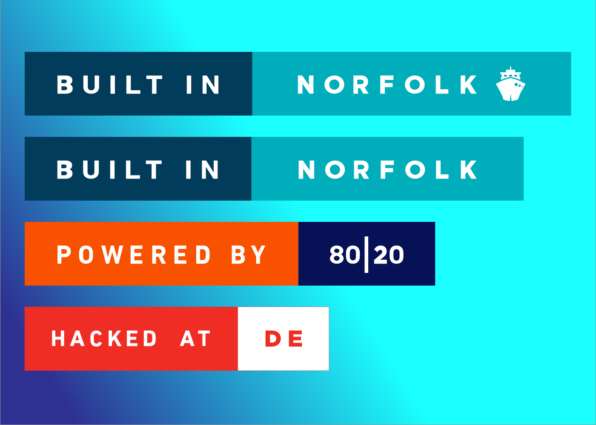

# Built in Norfolk | Badges



> Badges for when you're hacking out in Norfolk.

### To include a badge in your README, just copy the `Markdown`.


## Built in Norfolk with Ship


**Markdown**

```markdown

```

## Built in Norfolk


**Markdown**

```markdown

```

## Powered by 80|20


**Markdown**

```markdown

```

## Hacked at DE


**Markdown**

```markdown

```

### Credits

- [Sketch 3](http://www.sketchapp.com/) (for all design things)
- [For the Badge](https://github.com/BraveUX/for-the-badge)  (original inspiration)
